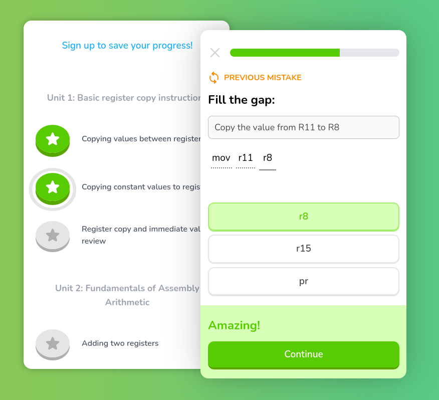

# Asmlingo

A Duolingo-like microlearning prototype for learning SuperH assembly (or any assembly language).



## Overview

> [!NOTE]
> This project is a learning exercise developed over the course of one week to explore and gain hands-on experience with TypeScript, Next.js 14, and Prisma ORM. While functional, it is not intended for production use. The primary goals were rapid learning, technology exploration, and demonstration of newly acquired skills.

Asmlingo is a educational app inspired by Duolingo's microlearning concept, designed to teach assembly language using a gamified approach. This project was developed as a week-long deep dive into a new tech stack for me: TypeScript, Next.js 14 and Prisma ORM.

## Features

- Interactive challenges for learning assembly.
- Progress tracking.
- Guest mode with optional user promotion (Sign In to save your progress).
- Responsive desing with CSS Modules for component styling and Tailwind CSS common utility classes.
- Animated challenge transition with Framer Motion.


## Tech Stack

- TypeScript
- Next.js 14
- React 18
- Prisma ORM with SQLite
- Iron Session for session management
- Zod for schema validation
- Vitest and React Testing Library for unit testing
- Playwright for end-to-end testing
- Storybook for component developement documentation
- Tailwind CSS

## Setup

1. Clone the repository.
2. Install dependencies with `npm install`.
3. Migrate and seed the database:
   ```bash
   $ npx prisma migrate dev
   $ npx tsx scripts/seed.ts
   ```
4. Run the development server with `npm run dev`.
5. Explore tooling:
   1. Run Storybook with `npm run storybook`.
   2. Run tests with `npm test`.
   3. Run e2e tests with `npm run e2e`.
   4. Run Prisma Studio with `npx prisma studio`.

## Projct Structure

```
├── prisma ........... Prisma schema and migrations
├── public
├── scripts .......... Helper scripts
├── src .............. Application source code and
│   ├── app .......... Next.js pages and Server Actions
│   ├── components ... UI components and tests
│   ├── icons ........ SVG icons as React components
│   └── lib .......... Utility functions
└── tests ............ e2e tests
```

## Testing

This projects uses both unit and end-to-end tests. Unit tests are written with Vitest and React Testing Library, while end-to-end tests are written with Playwright.

There is much more to be done in terms of testing, such as adding more unit tests for expected behaviors and edge cases, and adding e2e tests for authentication.

## Challenges and Learnings

- **TypeScript**: Really powerful for avoiding run time errors and improving code readability, I'm looking forward to using it in more projects.
- **Next.js 14**: First time using Next.js. Easy to start with, but took some time to adapt to the opinionated structure and data fetching patterns. I should revisit this project in the future now that I have a better understanding of the framework.
- **Prisma ORM**: I have to be honest, having types for my queries and results on both the client and server side is something I'll really miss in other projects.


## Future improvements
- [ ] Address TODOs in codebase.
- [ ] Rethink the architecture to better separate concerns.
- [ ] Add styles to the Sign Up page.
- [ ] Add Sign In page.
- [ ] Backoffice panel for managing challenges and lessons.
- [ ] Internationalization
- [ ] Add missing cascade on delete referential actions.
- [ ] Measure test coverage and add more tests.

## Final thoughts

This project was a fun learning experience. I'm happy with the result, but I would like to revisit now that I can focus more on the architecture instead of learning the tech stack.
